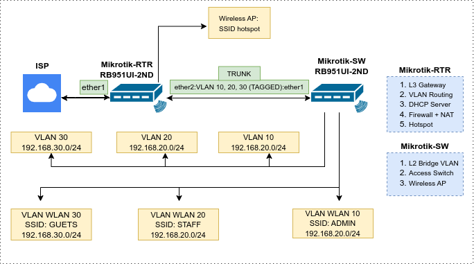

# MikroTik VLAN & Wireless Lab

## 1. Introduction
This repository contains documentation and configuration files for a MikroTik-based network
implementation following an **enterprise network design** approach.  The lab utilizes two MikroTik RB951Ui-2nD devices with a clear separation of roles between a **core router (Layer 3)** and an **access switch with wireless access point functionality (Layer 2)**.

Primary objectives:
- Network segmentation using VLAN
- VLAN-based wireless implementation
- Guest WiFi access using a captive portal (Hotspot)
- Centralized routing, firewall, and security management
---
## 2. Network Topology
The network topology is designed based on a simplified enterprise architecture, with a clear separation between the access layer and the core layer.

- **MikroTik-RTR** – Core Router  
  - Acts as the main network gateway
  - Handles inter-VLAN routing
  - Provides DHCP services
  - Manages NAT, firewall rules, and Hotspot services

- **MikroTik-SW** – Access Switch  
  - Operates as an access switch
  - Provides wireless access point functionality
  - Establishes a VLAN trunk link to the core router
  - Does not perform routing or NAT

Detailed technical documentation related to network planning and design is available in the `docs/` directory:

- **VLAN Design & Network Segmentation**  
  Explanation of VLAN architecture, trunk and access port design, wireless VLAN mapping, and inter-VLAN routing policies.  
   [`docs/vlan-design.md`](docs/vlan-design.md)

- **IP Addressing Plan**  
  IP addressing scheme, gateways, DHCP pools,
  and DNS configuration for each VLAN.  
   [`docs/ip-plan.md`](docs/ip-plan.md)
---
## 3. VLAN and IP Address Design
Network segmentation is implemented using VLANs to separate functions and enhance overall network security.

| VLAN ID | VLAN Name | Purpose        | Subnet            |
|--------:|-----------|----------------|-------------------|
| 10      | ADMIN     | Administrators | 192.168.10.0/24   |
| 20      | STAFF     | Employees      | 192.168.20.0/24   |
| 30      | GUEST     | Guests         | 192.168.30.0/24   |

Each VLAN includes:
- A dedicated VLAN interface on the router
- Its own default gateway
- An independent DHCP server
---
## 4. Wireless and VLAN Mapping
Each wireless SSID is directly mapped to a specific VLAN.

| SSID         | VLAN    | Security |
|--------------|---------|----------|
| WLAN-ADMIN   | VLAN 10 | WPA2     |
| WLAN-STAFF   | VLAN 20 | WPA2     |
| WLAN-GUEST   | VLAN 30 | Open     |

The access point operates purely as a Layer 2 bridge, while all network control and policy enforcement are handled by the **MikroTik-RTR**.

---
## 5. Guest Hotspot Design
Guest WiFi access is implemented using **MikroTik Hotspot**, deployed on the **MikroTik-RTR**.

Reasons for placing the Hotspot on the router:
- Hotspot must reside at the gateway to effectively control traffic
- Centralized firewall and NAT management
---
## 6. Network Security
The following security policies are applied:

- Guest VLAN is isolated from Admin and Office VLANs
- Guest VLAN is restricted from accessing router management services
- Firewall and NAT rules are centralized on the core router
- FastTrack is disabled to ensure proper Hotspot functionality
---
## 7. Configuration Files
Configurations are exported in `.rsc` format for documentation and portfolio purposes.

- Router configuration:  
  `/router/Mikrotik-RTR.rsc`

- Switch configuration:  
  `/switch/Mikrotik-SW.rsc`

---

## 8. Conclusion
This lab demonstrates an enterprise-oriented MikroTik network implementation, utilizing VLAN-based segmentation, VLAN-aware wireless networking, and a captive portal for secure and controlled guest access.

The design is scalable and reflects best practices commonly used in small to medium-scale enterprise networks.
